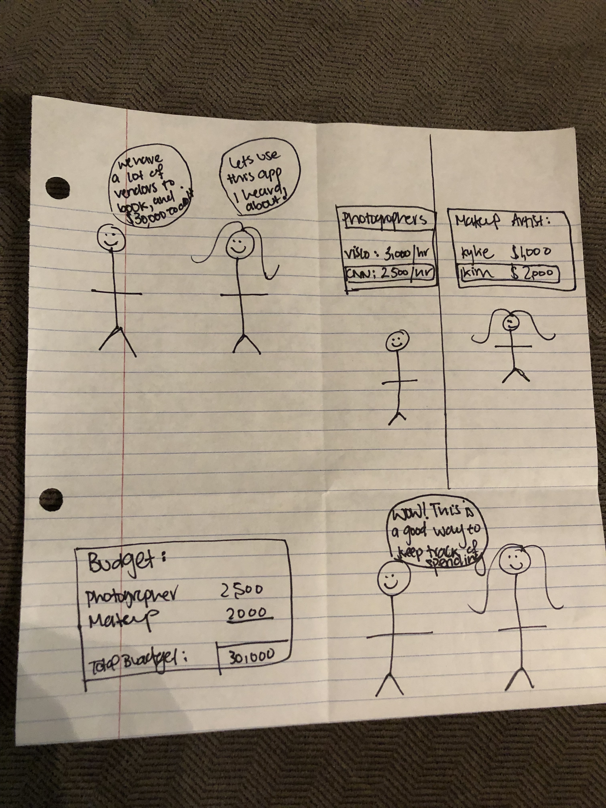
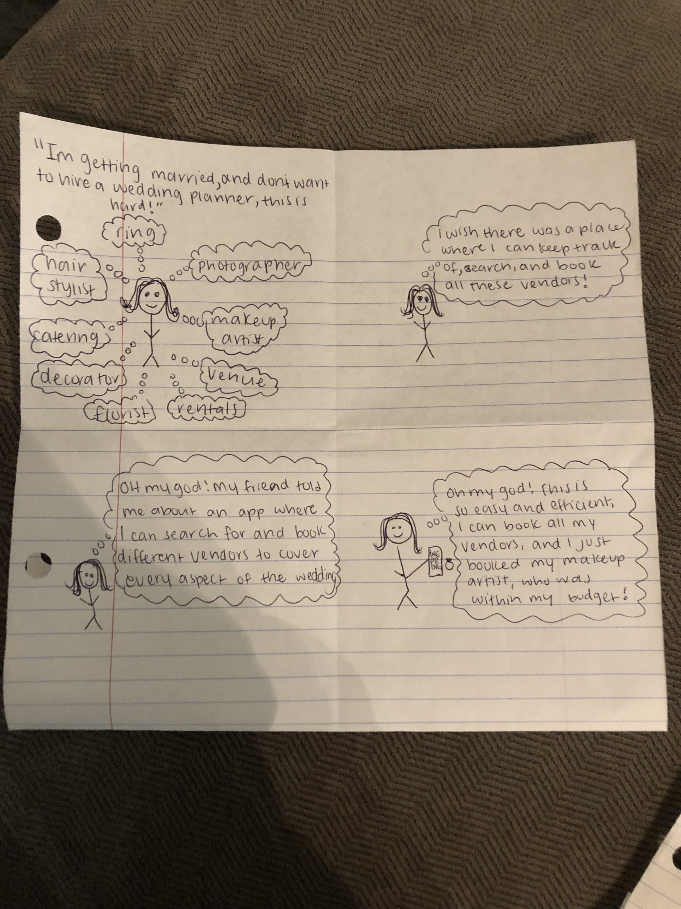

# Milestone 1

## Team Name

## Group Members
Yasmine Nassar
Hiba Dahbour
Noor Dahbour

## Project Idea
    Our app aims to create a one-stop app for all of the brides-to-be’s needs. Without a wedding planner, planning an entire wedding can be super difficult, as there are so many things to keep track of. Once you get the venue and date locked in, you still may have to book a makeup artist, photographer, videographer, among other things. Brides want to be able to filter for the budget of the vendor, the distance of the vendor from the venue, and look through the previous work of that vendor. In this app, they can do just that - search and book vendors, contact and find vendors’ instagrams, keep track of their wedding budget, find images off of pinterest/instagram that they can save in a ‘wedding mood board,’ and keep a checklist of remaining tasks left before their wedding. 
	  For the scope of this project, we’d like to focus on (1) searching for makeup artists and photographers (which will consist of filtering for their location and availability, contact info, and links to their instagram accounts), (2) maintaining a budget sheet, (3) keep a checklist of remaining tasks, (4) have a countdown until the wedding and progress bar of completed items, and lastly, if we have enough time, allow users to create boards via pinterest and instagram. 
	  This fits the theme because we are designing for people very different than ourselves - brides. None of us are planning to get married any time soon, thus, we wouldn’t be in the audience of our own app.
	  We want to be able to incorporate the Instagram and Pinterest API’s to allow users to search through related Instagram hashtags to create their boards, and to allow users to quickly and easily find the makeup artist/photographer’s instagram accounts to view their previous work.
 

## Storyboards

## Paper Prototypes

