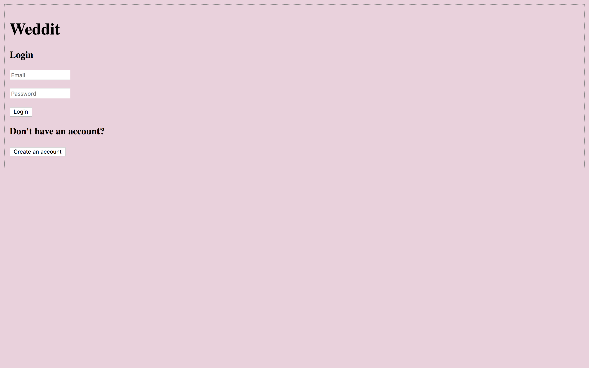
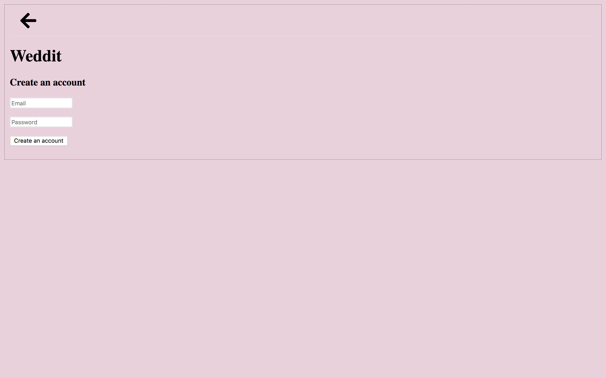
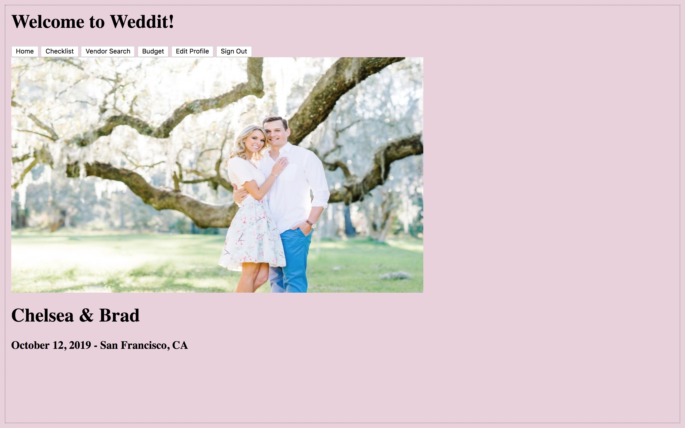
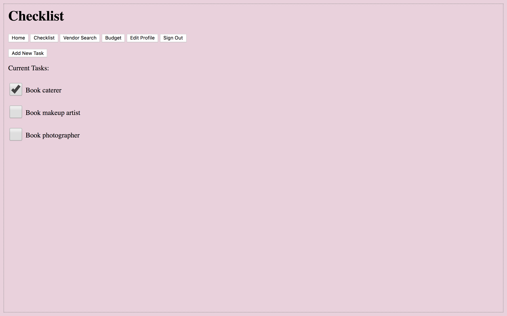
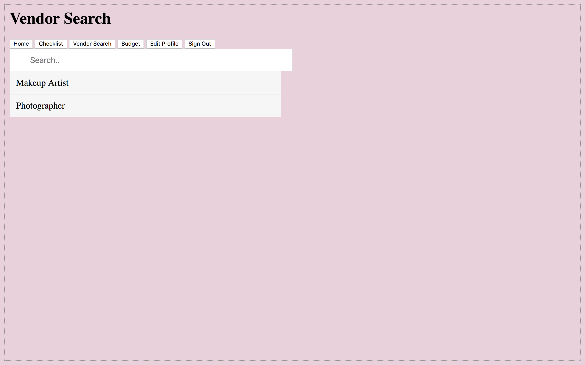
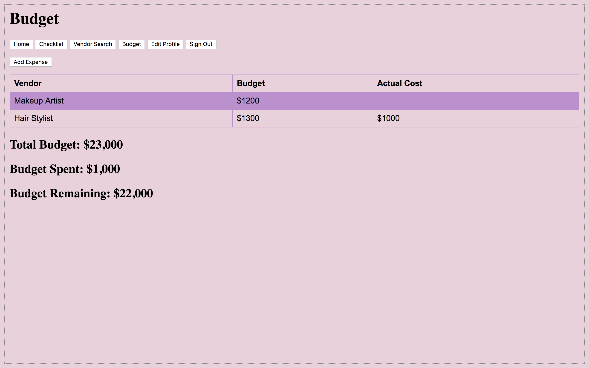
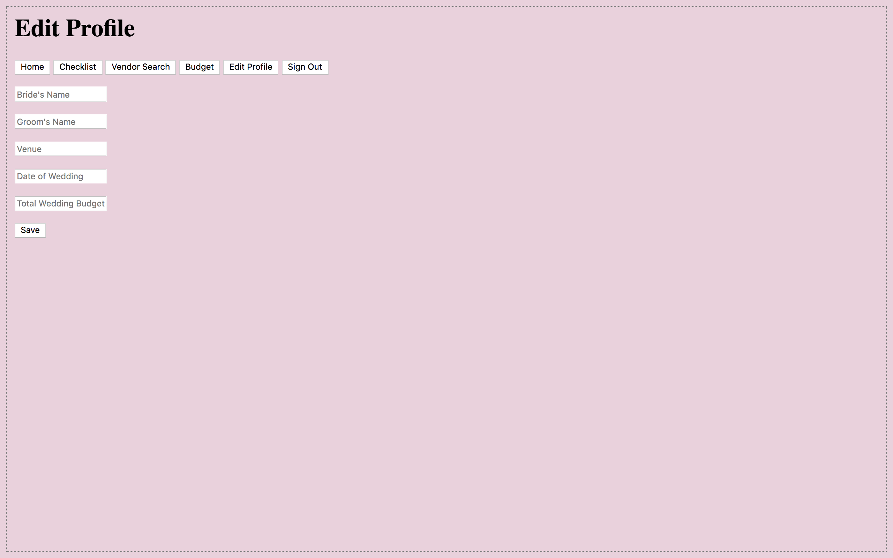

# Milestone 1

## Team Name
Noice

## Group Members
Yasmine Nassar

Hiba Dahbour

Noor Dahbour

## Changes Made
In milestone 2, we began to create the skeleton of our web application, Weddit. 
There are a couple of things that we had to change, that were originally in our paper
prototypes. Initially, we wanted to have a mood board where the user could save 
photos as inspiration for their wedding ideas. However, we decided to focus on other
features like budget, checklist, and vendor search. We will be using the instagram 
API to output posts to the user when they search for vendors. For example, if a
user wants to find a makeup artist, we will create hashtags using their wedding
venue's location (we have that information already when the couple creates an
account), and the vendor they want (ie, #SanFranciscoMakeupArtist), and then
output the posts that have that hashtag. Then, the user can look through these
posts, and find vendors they like. All in all, the skeleton of the web app mostly 
followed the paper prototypes we submitted for milestone 1.  
 

## UI Skeleton Screenshots
Our two main screens that we chose to implement are the home page (index.html)
and the budget page (budget.html).

Write comment here about login

Write comment here about creating account

Write comment here about home page

Write comment here about checklist page

Write comment here about vendor search

Write comment here about budget

Write comment here about editing profile page
