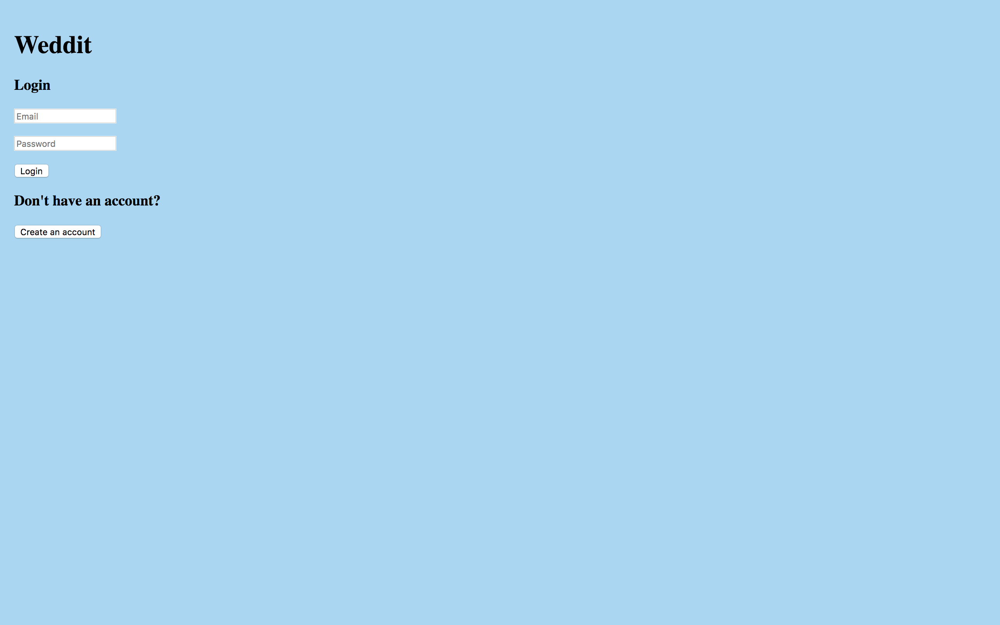
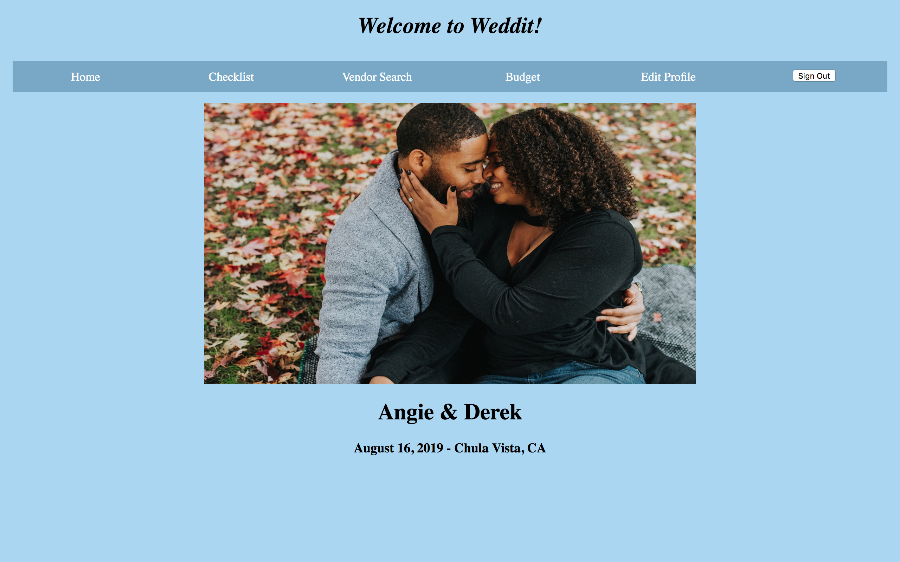
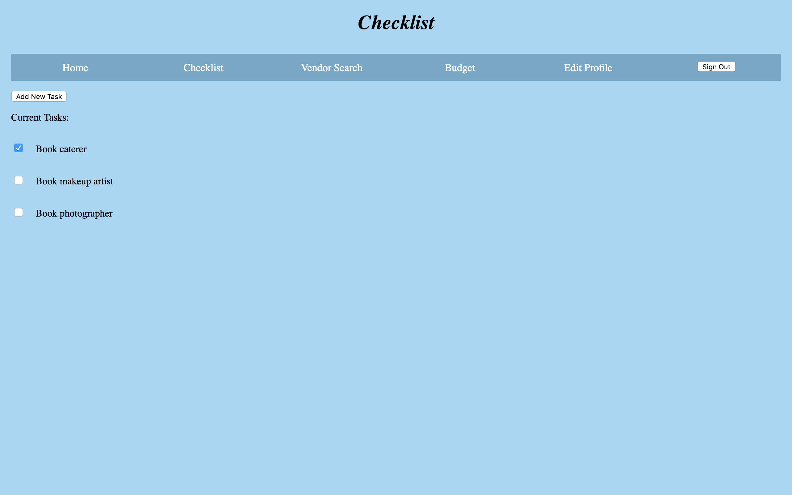
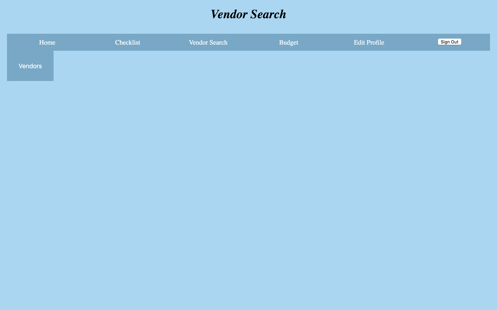
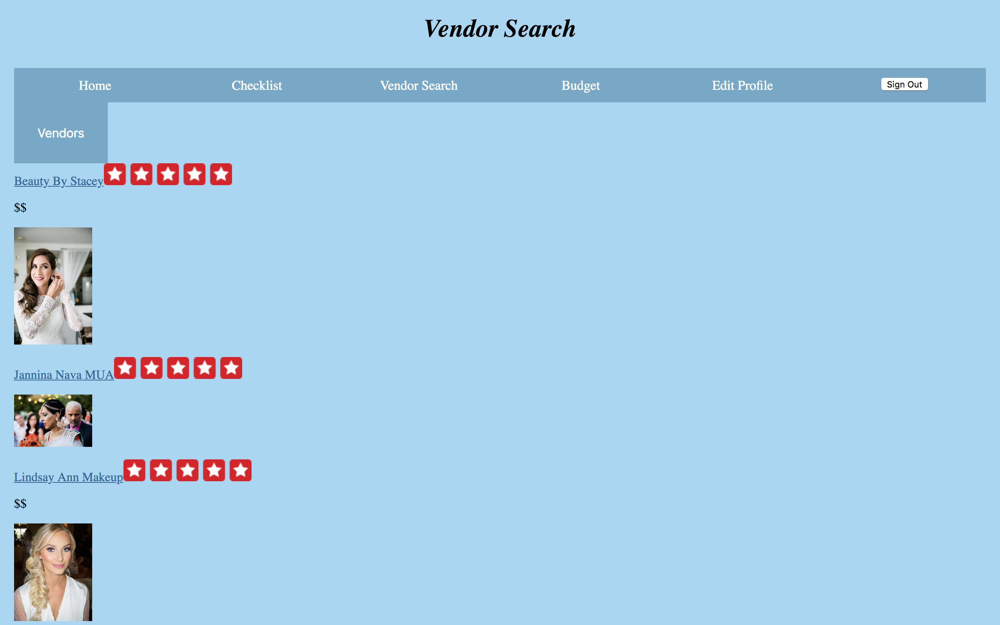
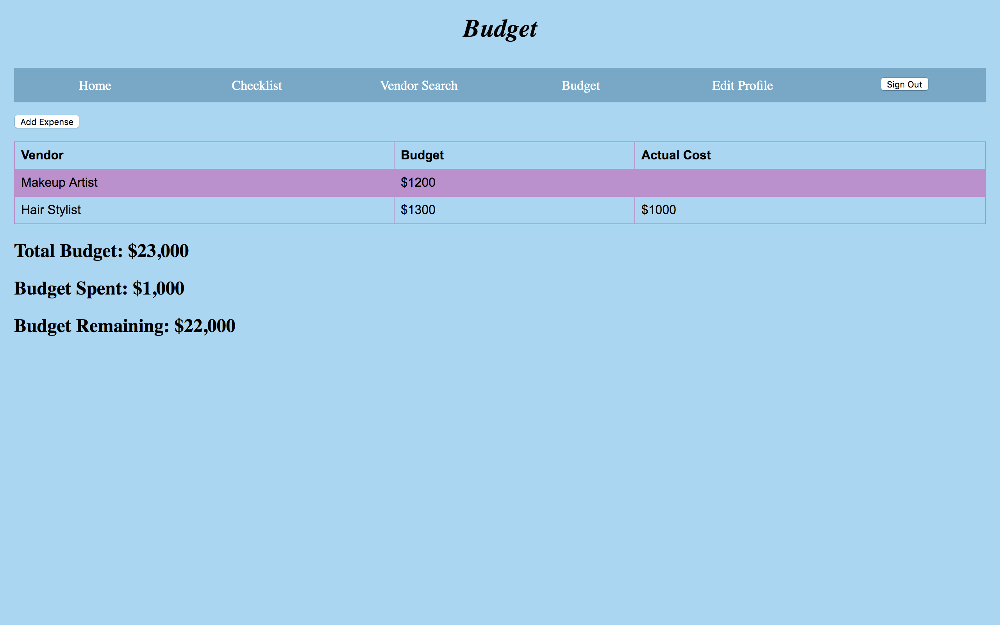
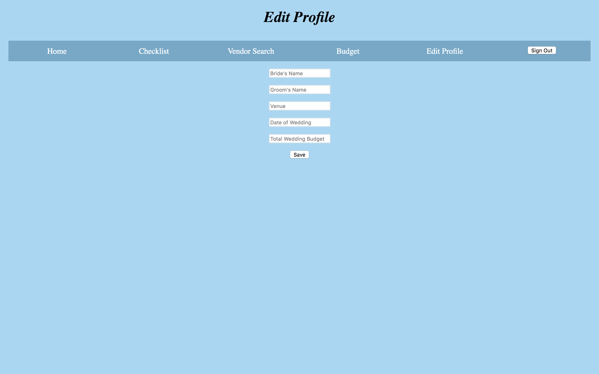

# Milestone 3

## Team Name
Noice

## Group Members
Yasmine Nassar

Hiba Dahbour

Noor Dahbour

 

## UI Skeleton Screenshots
Our two main screens that we chose to implement are the home page (index.html)
and the budget page (budget.html).

The log in page in the skeleton was inspired by out paper prototype.It is mostly the same. We do not have a logo creates yet, however we intend to add that by the name of our app at the top of the page once it is created. And instead of having a sign in or sign up button like we did in the paper prototype, we have a login button for people who want to sign in and an option for those who do not have an account, to create one. 

The home page here is very similar to the paper prototype except that we do not have the feature that will countdown to the day of the couple's wedding.

The checklist page in our skeleton is identical to the checklist page we have in our paper prototypes.

The vendor search page is also identical to the vendor search page we have in our paper prototype.

The vendor search page is also identical to the vendor search page we have in our paper prototype.

The budget page here is very similar to that in the paper prototypes. We decided to have the total budget, budget spent, and budget remaining on their own, rather than with the vendor list, budget, and what was actually spent.

The edit profile tab is one that we did not have in our paper prototypes. It is a feature we decided to add upon creating the skeleton. 
