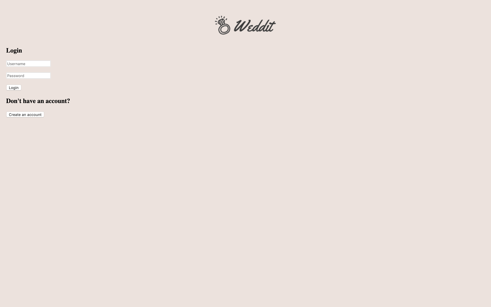
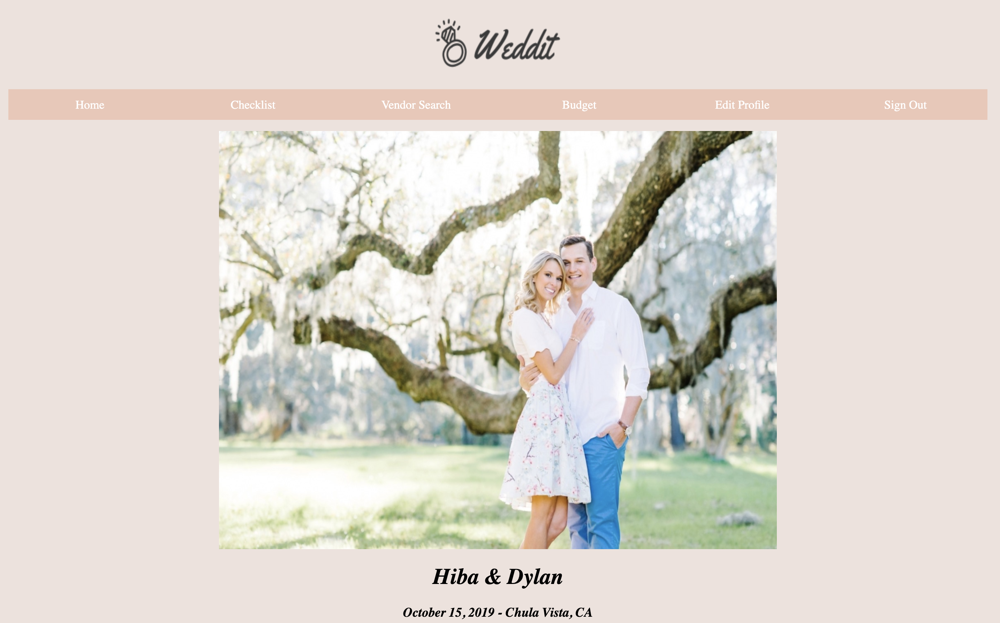
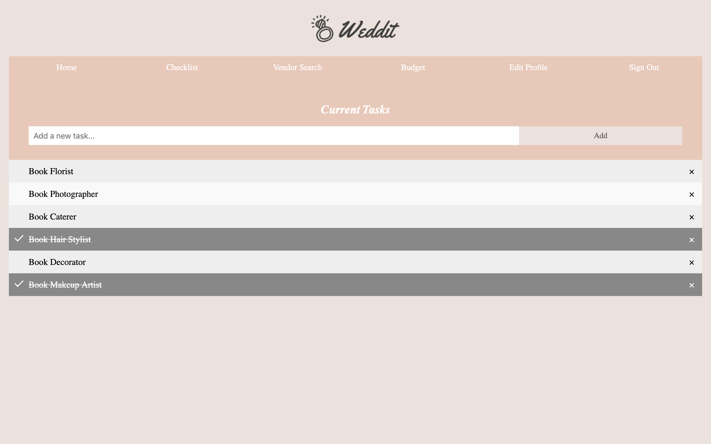
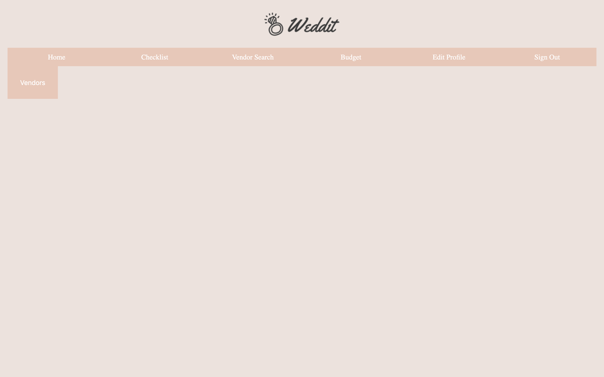
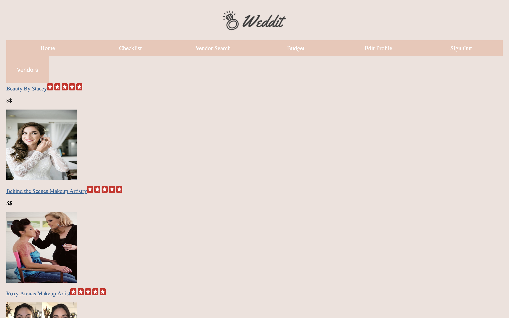
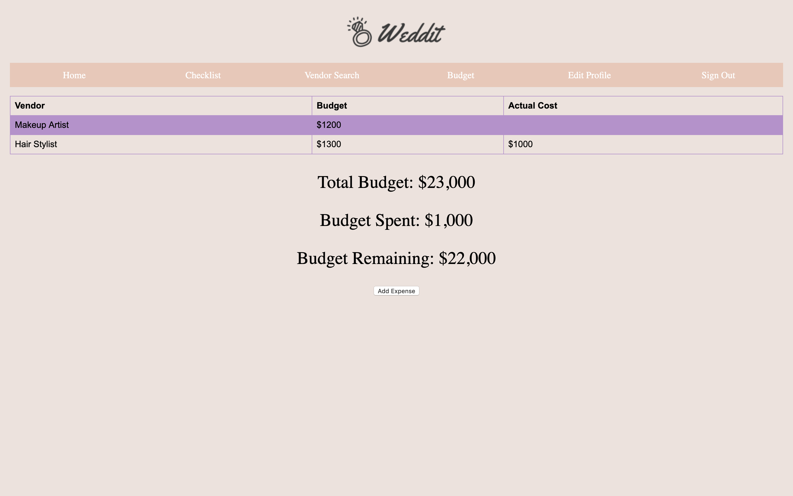
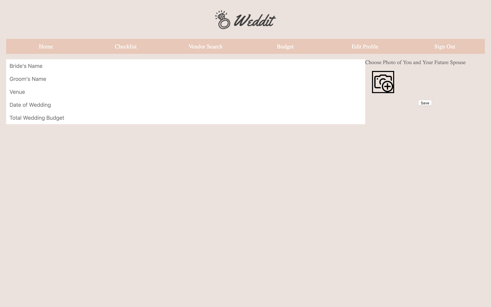

# Milestone 4

## Team Name
Noice

## Group Members
Yasmine Nassar

Hiba Dahbour

Noor Dahbour

 

## UI Skeleton Screenshots
Screenshots of our new UI and how they are different than milestone 2.

The log in page has the same options of inputting your username and password, and it also gives the user the option to create a new account. Pressing that button would redirect the user t the create account page. The log in page now has had a color change, to a more neutral pallet and the logo has been added in the header, above the tabs.

The home page has a color change that is more neutral to accommodate for the wedding mood. It also has a logo added on top at the header, which relays the app name and has a image of a diamond ring. The photo has now been made larger so that it can cover more space on the home page.The name of the couple, date, and location of the wedding are now in cursive and relayed under the photo. 

The checklist is now functional and done. There is a tab at the top that says “current tasks” There is also a bar where the user can type a new task and hit “add” to add the task to the list. Once the user finishes a task, there is an option with an “X” on the far right of every task where you can choose to remove that task so that you know it has been completed. There ha also been a color change, to a more neutral pallet, and the logo has been added in the header,above the tabs.

The vendor search does the same task and allows the user to search for the vendor of their choice, and for now that is either photographer or makeup artist, using the yelp API. The vendor search now shows a dollar sign amount with each vendor, which is generated by yelp, to show how pricy the vendor is overall. There has also been a color change, to a more neutral pallet, and the logo has been added in the header, above the tabs. 

This page shows what the results of the vendor search is once you select what vendor you want to search for. These are the options that come up for makeup artist, generated by yelp.

The expense sheet now has had a color change, to a more neutral pallet, and the logo has been added in the header, above the tabs. The budget sheet still keeps track of the budget per itemthe actual cost per item, the total budget, the total budget spent, and the total budget left.The button for adding an expense has also been moved to the bottom of the sheet under the total budget, total budget spent, and total budget left. Everything has also been centered. 

The edit profile sheet now has had a color change, to a more neutral pallet, and the logo has been added in the header, above the tabs. There is also a big change to the boxed where you can input information to edit your profile. The boxes have been shifted to the left, and now there is an option to upload a picture of the couple so that it can show up on the users home page. The “save” button is under the option to upload a picture. Once the user has completed inputting their information and their picture, then they can save and their new information will be relayed. 

We still plan on changing the buttons to be nicer, and displaying the results in
a more aesthetic way!

## Trivial Tasks

1. Checklist Page
	The checklist page is the first of our non trivial actions. A user is able to go to the checklist page and add a task by typing it in the bar and hitting “add”. The task will show up at the bottom. When the task has been completed, the user can click on the bar, and there will be a check that appears to the left of the word to show that it has been completed. If a user needs to remove the task completely from their list, they can hit on the ‘x’ to the right of the word, and that will remove it from the list. 

2. Edit Profile Page
	The edit profile page is where the user can go and make changes to their existing profile. When the user goes to the edit profile page, they are able to edit their name, the groom name, the venue, the date of their wedding, the total budget, and their photo. All these changes will be relayed on the home page. Not all categories have to be edited so that the changes are reflected on the home page. 

