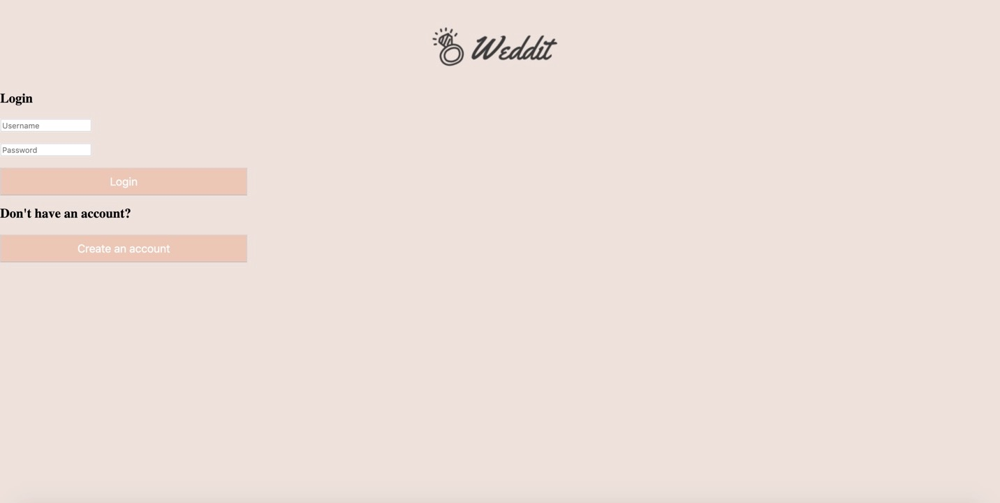
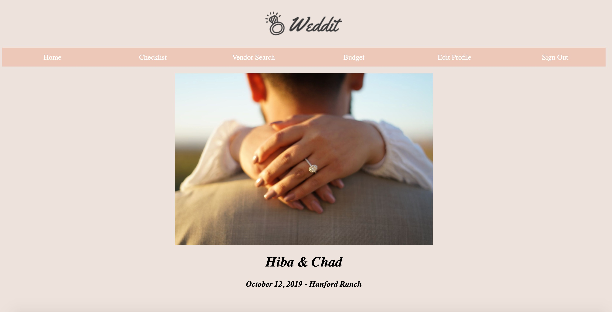
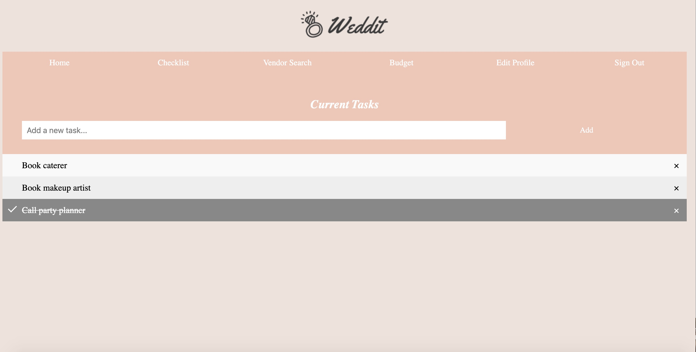
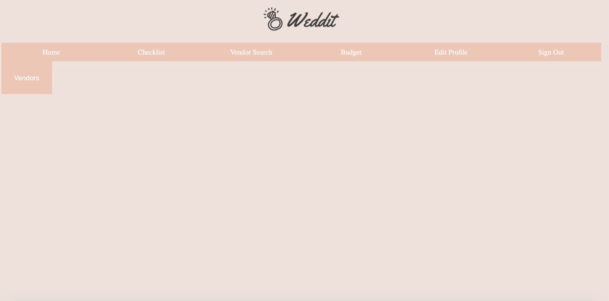
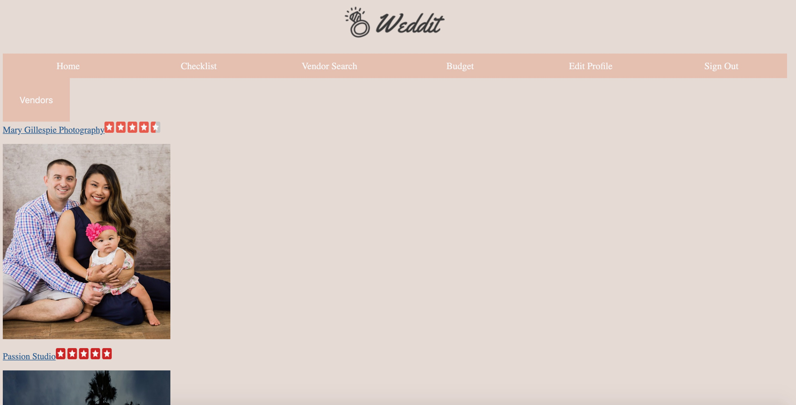
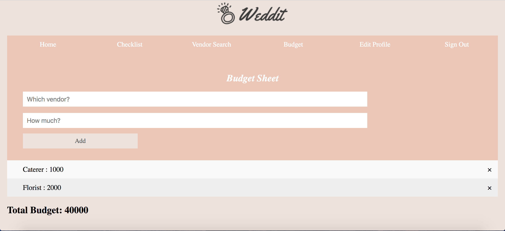
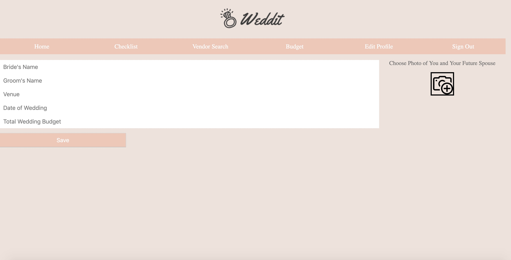

# Milestone 5

## Team Name
Noice

## Group Members
Yasmine Nassar

Hiba Dahbour

Noor Dahbour

 

## UI Skeleton Screenshots
Screenshots of our new UI and how they are different than milestone 3.

The sign out, create account, and log in page now have better buttons. They are larger, and are matching to the colors of the website, and are a lot nicer. 

Home Page: The photo has been formatted so that when the user logs in the photo is displayed along with the couple’s names, their wedding location, and their wedding date. We changed the dimensions of the photo to be more centered.

Checklist is  done, and is fully functional. The user can add items to the checklist. They can also check something off their list, and they can remove something from their checklist. A new feature for the checklist in this milestone is that if you check it or uncheck it, and log out or navigate to a new page, it’ll save your changes in the database

Nothing has changed for this page in the new milestone.

This page shows what the results of the vendor search is once you select what vendor you want to search for. These are the options that come up for makeup artist, generated by yelp. The only thing we were able to change was the dimensions of each vendor's photo.

Budget: The budget page has been updated, the page looks much nicer and more aesthetic. The user can add a vendor and the amount of money they spent on that vendor. The ttotal proposed budget is displayed on the bottom. The user can also delete a row of the expense sheet.

Edit profile: The page has been edited so that the format makes more sense and is easier to use. The save button has been edited to be bigger and match the rest of the colors the website has.

## Other Tasks From Rubric

6. To get the actual data, we used the Yelp API. In terms of visualizations, we
   just retrieved info from the API and formatted it into HTML elements (ie,
   Divs, etc). We also downloaded the Yelp stars, and added the photo of stars
   for each vendor that was output. We still would've liked to format the vendor
     search page to be prettier - maybe centered. 

7. Starting with the home page, it would be ideal if we had a way to span any photo the couple uploads so that it could cover the entire page. It would be nice if the couple name and date could overlay on the photo as well. We wanted to incorporate a countdown to the wedding as well on the home page. On the checklist page, we managed to complete everything we wanted to. We want the budget page to be more like an excel sheet where once any category or number is inputted, there is a live update of how much of the budget has been used, and how much more is left to spend. We also have the page where the couples can look up vendors, we are still working on making this page look more aesthetic and user friendly. At one point we wanted to incorporate a mood board section where the Pinterest API would be used for the user to save ideas that they would like to incorporate for their wedding.
